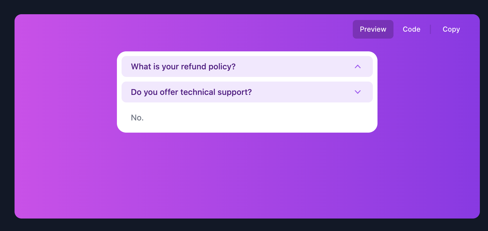
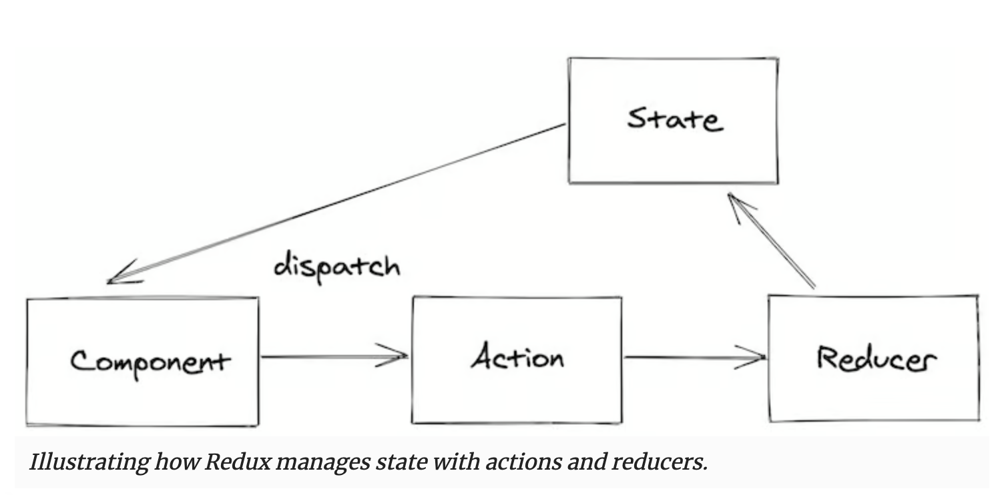

# HeadlessUI code reading

link https://github.com/tailwindlabs/headlessui/tree/main/packages/%40headlessui-react

## New topics

- Context の分割
  - useOpenClosed の必要性について
  - API への分割
- Object.assign
- hooks
  - useSyncRefs
  - useEvent
- render 関数の必要性。なぜそこまで複雑な handling が必要なのか
- 参照について useRef 自体が何者で、なぜ useSyncRefs が必要なのか

## Target component

Disclosure<br>
https://headlessui.com/react/disclosure<br>
https://github.com/tailwindlabs/headlessui/tree/main/packages/%40headlessui-react/src/components/disclosure



---

## Look into deeply

React Context (特定の関数の中だけで生存する関数を持つ方法。関数の寿命とは違うスコープで変数を管理することができる)で状態を限定的に管理している。<br>
https://react.dev/reference/react/useContext

Component の描画には独自の render 関数を用意している。https://github.dev/tailwindlabs/headlessui/blob/main/packages/@headlessui-vue/src/components/disclosure/disclosure.ts#L58<br>
render の内部では Component の値をハンドリングして描画されるようになっている。

```tsx
interface ComponentDisclosure extends HasDisplayName {
  <TTag extends ElementType = typeof DEFAULT_DISCLOSURE_TAG>(
    props: DisclosureProps<TTag> & RefProp<typeof DisclosureFn>,
  ): JSX.Element
}

interface ComponentDisclosureButton extends HasDisplayName {
  <TTag extends ElementType = typeof DEFAULT_BUTTON_TAG>(
    props: DisclosureButtonProps<TTag> & RefProp<typeof ButtonFn>,
  ): JSX.Element
}

interface ComponentDisclosurePanel extends HasDisplayName {
  <TTag extends ElementType = typeof DEFAULT_PANEL_TAG>(
    props: DisclosurePanelProps<TTag> & RefProp<typeof PanelFn>,
  ): JSX.Element
}

/**
 * This is a hack, but basically we want to keep the full 'API' of the component, but we do want to
 * wrap it in a forwardRef so that we _can_ passthrough the ref
 */
export function forwardRefWithAs<
  T extends { name: string; displayName?: string }
>(component: T): T & { displayName: string } {
  return Object.assign(forwardRef((component as unknown) as any) as any, {
    displayName: component.displayName ?? component.name,
  })
}

let DisclosureRoot = (forwardRefWithAs(
  DisclosureFn,
) as unknown) as ComponentDisclosure
let Button = (forwardRefWithAs(
  ButtonFn,
) as unknown) as ComponentDisclosureButton
let Panel = (forwardRefWithAs(PanelFn) as unknown) as ComponentDisclosurePanel

// https://developer.mozilla.org/ja/docs/Web/JavaScript/Reference/Global_Objects/Object/assign
// DiscloserRoot に Button と Panel をプロパティとして上書きする
export let Disclosure = Object.assign(DisclosureRoot, { Button, Panel })
```

### DisclosureFn

```typescript
export type DisclosureProps<TTag extends ElementType> = Props<
  TTag,
  DisclosureRenderPropArg
> & {
  defaultOpen?: boolean
}
function DisclosureFn<TTag extends ElementType = typeof DEFAULT_DISCLOSURE_TAG>(
  props: DisclosureProps<TTag>,
  ref: Ref<HTMLElement>,
) {
  return (
    <DisclosureContext.Provider value={reducerBag}>
      <DisclosureAPIContext.Provider value={api}>
        <OpenClosedProvider
          value={match(disclosureState, {
            [DisclosureStates.Open]: State.Open,
            [DisclosureStates.Closed]: State.Closed,
          })}
        >
          {render({
            ourProps,
            theirProps,
            slot,
            defaultTag: DEFAULT_DISCLOSURE_TAG,
            name: 'Disclosure',
          })}
        </OpenClosedProvider>
      </DisclosureAPIContext.Provider>
    </DisclosureContext.Provider>
  )
}
```

#### DisclosureContext

DisclosureContext は State とそれを変更する dispatcher を持つ作り。<br>
useReducer を利用して Redux 方式の dispatcher pattern を採用。<br>

https://blog.logrocket.com/guide-understanding-react-state-patterns/



```typescript
enum ActionTypes {
  ToggleDisclosure,
  CloseDisclosure,

  SetButtonId,
  SetPanelId,

  LinkPanel,
  UnlinkPanel,
}
type Actions =
  | { type: ActionTypes.ToggleDisclosure }
  | { type: ActionTypes.CloseDisclosure }
  | { type: ActionTypes.SetButtonId; buttonId: string | null }
  | { type: ActionTypes.SetPanelId; panelId: string | null }
  | { type: ActionTypes.LinkPanel }
  | { type: ActionTypes.UnlinkPanel }
type Dispatch<A> = (action: A) => void

interface StateDefinition {
  disclosureState: DisclosureStates

  linkedPanel: boolean

  buttonRef: MutableRefObject<HTMLButtonElement | null>
  panelRef: MutableRefObject<HTMLDivElement | null>

  buttonId: string | null
  panelId: string | null
}

let DisclosureContext = createContext<
  [StateDefinition, Dispatch<Actions>] | null
>(null)
```

useContext は単純に context がセットされているかを確認しているだけ

```typescript
function useDisclosureContext(component: string) {
  let context = useContext(DisclosureContext)
  if (context === null) {
    let err = new Error(
      `<${component} /> is missing a parent <Disclosure /> component.`,
    )
    if (Error.captureStackTrace)
      Error.captureStackTrace(err, useDisclosureContext)
    throw err
  }
  return context
}
```

初期値は useReducer で reducer パターンを採用してセットされている。

```ts
let reducerBag = useReducer(stateReducer, {
  disclosureState: defaultOpen // discloser が開いているか閉じているか
    ? DisclosureStates.Open
    : DisclosureStates.Closed,
  linkedPanel: false, // discloser と連動して開いたり閉じたりする Panel があるかどうか
  buttonId: null, // ボタン要素の識別子
  buttonRef, // ボタン要素の参照を格納する
  panelId: null, // Panel 要素の識別子
  panelRef, // Panel 要素の参照を格納する
} as StateDefinition)
```

reducer は、match 関数によって reducers の中から action.type に該当する関数が呼ばれ state が更新されます。

```ts
function stateReducer(state: StateDefinition, action: Actions) {
  return match(action.type, reducers, state, action)
}
```

```ts
export function match<
  TValue extends string | number = string,
  TReturnValue = unknown
>(
  value: TValue,
  lookup: Record<TValue, TReturnValue | ((...args: any[]) => TReturnValue)>,
  ...args: any[]
): TReturnValue {
  if (value in lookup) {
    let returnValue = lookup[value]
    return typeof returnValue === 'function'
      ? returnValue(...args)
      : returnValue
  }

  let error = new Error(
    `Tried to handle "${value}" but there is no handler defined. Only defined handlers are: ${Object.keys(
      lookup,
    )
      .map((key) => `"${key}"`)
      .join(', ')}.`,
  )
  if (Error.captureStackTrace) Error.captureStackTrace(error, match)
  throw error
}
```

reducers はこちら。<br>
ボタンやパネルの紐付け、discloser の開閉を管理している

```ts
let reducers: {
  [P in ActionTypes]: (
    state: StateDefinition,
    action: Extract<Actions, { type: P }>,
  ) => StateDefinition
} = {
  [ActionTypes.ToggleDisclosure]: (state) => ({
    ...state,
    disclosureState: match(state.disclosureState, {
      [DisclosureStates.Open]: DisclosureStates.Closed,
      [DisclosureStates.Closed]: DisclosureStates.Open,
    }),
  }),
  [ActionTypes.CloseDisclosure]: (state) => {
    if (state.disclosureState === DisclosureStates.Closed) return state
    return { ...state, disclosureState: DisclosureStates.Closed }
  },
  [ActionTypes.LinkPanel](state) {
    if (state.linkedPanel === true) return state
    return { ...state, linkedPanel: true }
  },
  [ActionTypes.UnlinkPanel](state) {
    if (state.linkedPanel === false) return state
    return { ...state, linkedPanel: false }
  },
  [ActionTypes.SetButtonId](state, action) {
    if (state.buttonId === action.buttonId) return state
    return { ...state, buttonId: action.buttonId }
  },
  [ActionTypes.SetPanelId](state, action) {
    if (state.panelId === action.panelId) return state
    return { ...state, panelId: action.panelId }
  },
}
```

#### DisclosureAPIContext

API context では close 関数を提供している。

```tsx
let DisclosureAPIContext = createContext<{
  close(
    focusableElement?: HTMLElement | MutableRefObject<HTMLElement | null>,
  ): void
} | null>(null)
DisclosureAPIContext.displayName = 'DisclosureAPIContext'

export let useIsoMorphicEffect = (
  effect: EffectCallback,
  deps?: DependencyList | undefined,
) => {
  // SSR 対応
  if (env.isServer) {
    useEffect(effect, deps)
  } else {
    // https://devsakaso.com/react-differences-between-useeffect-and-uselayouteffect/
    useLayoutEffect(effect, deps)
  }
}

// 同期処理内でのコールバック関数やsetTimeoutのコールバック内で値を参照する場合、useLatestValueを使用することで、コールバック内で参照される値が最新の値になることが保証されます。
export function useLatestValue<T>(value: T) {
  let cache = useRef(value)

  useIsoMorphicEffect(() => {
    cache.current = value
  }, [value])

  return cache
}

export let useEvent =
  // TODO: Add React.useEvent ?? once the useEvent hook is available
  function useEvent<
    F extends (...args: any[]) => any,
    P extends any[] = Parameters<F>,
    R = ReturnType<F>
  >(cb: (...args: P) => R) {
    // 常に最新の callback function を参照する
    let cache = useLatestValue(cb)
    return React.useCallback((...args: P) => cache.current(...args), [cache])
  }

// discloser を close して focus を当てている
let close = useEvent(
  (focusableElement?: HTMLElement | MutableRefObject<HTMLElement | null>) => {
    dispatch({ type: ActionTypes.CloseDisclosure })
    // document が常に正しいわけではないのでこの対応になっている
    // https://developer.mozilla.org/ja/docs/Web/API/Node/ownerDocument
    // https://github.com/tailwindlabs/headlessui/pull/1158
    let ownerDocument = getOwnerDocument(internalDisclosureRef)
    if (!ownerDocument) return
    if (!buttonId) return // buttonId は DisclosureContext の中の値

    let restoreElement = (() => {
      if (!focusableElement) return ownerDocument.getElementById(buttonId)
      if (focusableElement instanceof HTMLElement) return focusableElement
      if (focusableElement.current instanceof HTMLElement)
        return focusableElement.current

      return ownerDocument.getElementById(buttonId)
    })()

    restoreElement?.focus()
  },
)

function useDisclosureAPIContext(component: string) {
  let context = useContext(DisclosureAPIContext)
  if (context === null) {
    let err = new Error(
      `<${component} /> is missing a parent <Disclosure /> component.`,
    )
    if (Error.captureStackTrace)
      Error.captureStackTrace(err, useDisclosureAPIContext)
    throw err
  }
  return context
}

let api = useMemo<ContextType<typeof DisclosureAPIContext>>(() => ({ close }), [
  close,
])
```

#### OpenClosedProvider

用途は不明。<br>
Discloser の値を別の Context として提供できるようにしている。

Context を複数階層に分けて提供するのはいいかもしれない。<br>
そうすることで、利用者側で余計な関数に頭を悩ませることがなくなる。

```
- Original
  |- API : 操作系だけ提供
  |- OpenClose : 開いているか閉じているかだけ提供
```

```tsx
let Context = createContext<State | null>(null)
Context.displayName = 'OpenClosedContext'

export enum State {
  Open = 1 << 0,
  Closed = 1 << 1,
  Closing = 1 << 2,
  Opening = 1 << 3,
}

export function useOpenClosed() {
  return useContext(Context)
}

export function OpenClosedProvider({ value, children }: Props): ReactElement {
  return <Context.Provider value={value}>{children}</Context.Provider>
}

enum DisclosureStates {
  Open,
  Closed,
}

<OpenClosedProvider
    value={match(disclosureState, {
    [DisclosureStates.Open]: State.Open,
    [DisclosureStates.Closed]: State.Closed,
    })}
>
```

### ButtonFn

Button component をただ wrap するだけの関数<br>
panelId の設定をしている。

```tsx
export type DisclosureButtonProps<TTag extends ElementType> = Props<
  TTag,
  ButtonRenderPropArg,
  ButtonPropsWeControl,
  {
    disabled?: boolean
  }
>

function ButtonFn<TTag extends ElementType = typeof DEFAULT_BUTTON_TAG>(
  props: DisclosureButtonProps<TTag>,
  ref: Ref<HTMLButtonElement>,
) {
  let buttonRef = useSyncRefs(
    internalButtonRef,
    ref,
    !isWithinPanel ? state.buttonRef : null,
  )
  let ourProps = isWithinPanel
    ? { ref: buttonRef, type, onKeyDown: handleKeyDown, onClick: handleClick }
    : {
        ref: buttonRef,
        id,
        type,
        'aria-expanded': props.disabled
          ? undefined
          : state.disclosureState === DisclosureStates.Open,
        'aria-controls': state.linkedPanel ? state.panelId : undefined,
        onKeyDown: handleKeyDown,
        onKeyUp: handleKeyUp,
        onClick: handleClick,
      }

  return render({
    ourProps,
    theirProps,
    slot,
    defaultTag: DEFAULT_BUTTON_TAG,
    name: 'Disclosure.Button',
  })
}
j
```

操作は、useDisclosureContext で取得した値を利用する。<br>

```tsx
let handleClick = useEvent((event: ReactMouseEvent) => {
  if (isDisabledReactIssue7711(event.currentTarget)) return
  if (props.disabled) return

  if (isWithinPanel) {
    dispatch({ type: ActionTypes.ToggleDisclosure })
    state.buttonRef.current?.focus()
  } else {
    dispatch({ type: ActionTypes.ToggleDisclosure })
  }
})
```

### PanelFn

Panel component をただ wrap するだけの関数<br>
Panel 関数

```tsx
let DisclosurePanelContext = createContext<string | null>(null)
DisclosurePanelContext.displayName = 'DisclosurePanelContext'

function useDisclosurePanelContext() {
  return useContext(DisclosurePanelContext)
}

export type DisclosurePanelProps<TTag extends ElementType> = Props<
  TTag,
  PanelRenderPropArg
> &
  PropsForFeatures<typeof PanelRenderFeatures>

function PanelFn<TTag extends ElementType = typeof DEFAULT_PANEL_TAG>(
  props: DisclosurePanelProps<TTag>,
  ref: Ref<HTMLDivElement>,
) {
  let panelRef = useSyncRefs(ref, state.panelRef, (el) => {
    startTransition(() =>
      dispatch({ type: el ? ActionTypes.LinkPanel : ActionTypes.UnlinkPanel }),
    )
  })
  return (
    <DisclosurePanelContext.Provider value={state.panelId}>
      {render({
        ourProps,
        theirProps,
        slot,
        defaultTag: DEFAULT_PANEL_TAG,
        features: PanelRenderFeatures,
        visible,
        name: 'Disclosure.Panel',
      })}
    </DisclosurePanelContext.Provider>
  )
}
```

---

## Archived

以下は間違えて Vue.js のコードを追っていた。<br>
Symbol の使い方がちょっと勉強になったので残しておく

```tsx
let DisclosureContext = Symbol('DisclosureContext') as InjectionKey<
  StateDefinition
>
```

Symbol コンストラクタは一意の Symbol オブジェクトを返す。`Symbol('DisclosureContext') == Symbol('DisclosureContext')` は false になる。<br>
https://note.affi-sapo-sv.com/js-symbol.php では以下の 3 つの目的が示されている。

- プロパティ名の重複を避ける
- 外部からアクセスできないプロパティを作成する
- 定数としての利用

ここでの利用方法は、

https://developer.mozilla.org/en-US/docs/Web/JavaScript/Reference/Global_Objects/Symbol
